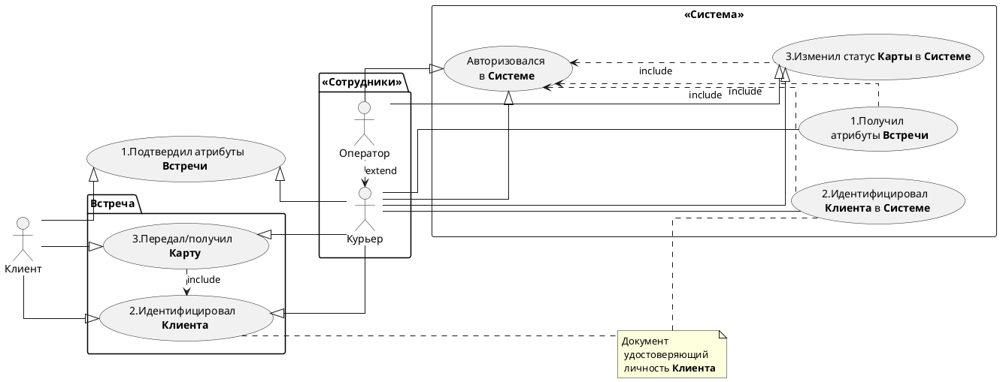

# Задание №2 
> Use Case, Sequence

### 1. Составить *Use Case* диаграмму
- 3-5 акторов;
- Все 3 вида связей.

### 2. Составить *Sequence* диаграмму

Мы хотим реализовать процесс заказа **Карты** через **Cайт**.
 Процесс выглядит следующим образом:
- Cначала **Клиент** заказывает **Карту** на **Сайте**;
- **Заявка** попадает в **Систему обработки заявок**;
- Далее **Клиент** проверяется в **Системе Скоринга** (можно ли выдавать ему карту);
- Затем **Карта** печатается в **Системе Печать**;
- И доставляется через **Систему Доставка**.

Итого у нас есть 5 систем: **Сайт**, **Система обработки заявок**, **Скоринг**, **Печать**, **Доставка**.
Каждая **Система** для нас является чёрным ящиком. Добавлять или удалять **Системы** нельзя.
Необходимо составить *sequence* диаграмму, которая будет отражать работу **Системы**.

-----

<table width="1000" border="1">
<thead>
  <tr>
    <td rowspan="3"></td>
    <td colspan="2" width="700">
<b>Доставка карты Клиенту Курьером</b>
</td>
  </tr>
  <tr>
    <td>Дата</td>
    <td>05.08.2024</td>
  </tr>
  <tr>
    <td>Версия</td>
    <td>1.0</td>
  </tr>
</thead>
</table>

