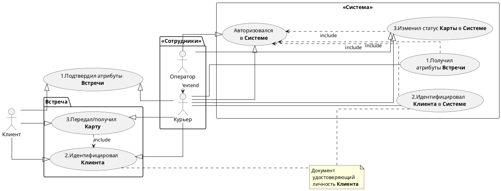
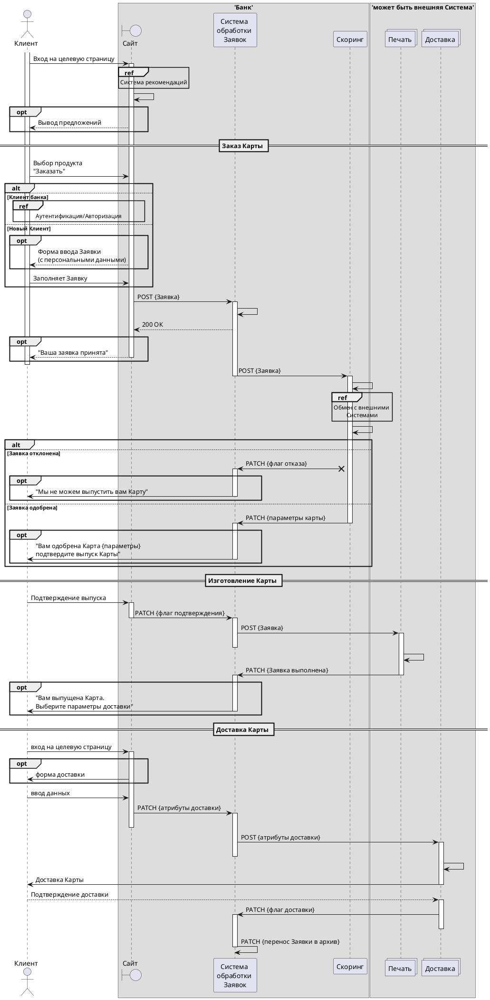

# Задание №2 
> Use Case, Sequence

  
### 1. Составить *Use Case* диаграмму
- 3-5 акторов;
- Все 3 вида связей.

### 2. Составить *Sequence* диаграмму

Мы хотим реализовать процесс заказа **Карты** через **Cайт**.
 Процесс выглядит следующим образом:
- Cначала **Клиент** заказывает **Карту** на **Сайте**;
- **Заявка** попадает в **Систему обработки заявок**;
- Далее **Клиент** проверяется в **Системе Скоринга** (можно ли выдавать ему карту);
- Затем **Карта** печатается в **Системе Печать**;
- И доставляется через **Систему Доставка**.

Итого у нас есть 5 систем: **Сайт**, **Система обработки заявок**, **Скоринг**, **Печать**, **Доставка**.
Каждая **Система** для нас является чёрным ящиком. Добавлять или удалять **Системы** нельзя.
Необходимо составить *sequence* диаграмму, которая будет отражать работу **Системы**.

-----

  
<table width="1000" border="1">
<thead>
  <tr>
    <td rowspan="3"></td>
    <td colspan="2" width="700">
<b>Доставка карты Клиенту Курьером</b>
</td>
  </tr>
  <tr>
    <td>Дата</td>
    <td>05.08.2024</td>
  </tr>
  <tr>
    <td>Версия</td>
    <td>1.0</td>
  </tr>
</thead>
</table>

 см. код plantUML 

  

<table width="1000" border="1">
<thead>
  <tr>
    <td rowspan="3"></td>
    <td colspan="2" width="700">
<b>Заказ Карты через Сайт</b>
</td>
  </tr>
  <tr>
    <td>Дата</td>
    <td>05.08.2024</td>
  </tr>
  <tr>
    <td>Версия</td>
    <td>1.0</td>
  </tr>
</thead>
</table>

![SVG](https://www.plantuml.com/plantuml/svg/dLVHRXj557sVhxZoIq35KF4ODQYbBxnHYJxouYQB5CdObUsMeifIOhUbA1Kk4HAe0YeaFc2zjPlDEgb_uSuVSOucszaPZKcWKhN9xDnpppttp9tDpU6eCnWz-BPhpAtTKNyW-afNMkfIp-t4c7lzHxAbFskkvrfjcS_x3tfxdS7tqjA_i7Pg9otf3EMxx9wOEy3Ptzs_t-cD-5fBUsWdm3dJNBxkwJkTsmF4pFKTbYijkVYhvdQc1LvM19B-O2yR30Ce85K8ET0I5DwOhBSd85KpEqFeMrtQYG3-o4xi2m7SELQUeu2PdKd8PClSxdUxsUvelzyRYhx6nXyqPrpuuXUaP50Ej4fpdtQh-SyqnP9hrqouqFwCoc1TjaMFxLDmNGZ8vMAVOSiA_mixjJy9Kr4Sl2ljCpirPf1z8_s7sO00Y8xanDubLT4pPjA5vW0izTHmjyjgJF_-AAHpeztc6t5iZhHmVDP40yQAKd8haLYmCJixmXPH0JsXCt9x0AP7ihEJAjL3pzan1uqSTgeLkDC6BO_dP6yPq-cEn4ZM7MOIO0A5Yb1-4QaL2VPyLElp4ZfEt1gKUeBtbHF5pZxHbrfWsNdef5wkC_u1XWKedmR0p0W1-TYeuTzAIFP32oScVwmjxHp-WJs43Bg4ReVOWTxhohu0r142Is68djU_ViXq49wFJUfIlZMGLhGtZT_82ECmkdQ1EqpEVdU-_EgkF6wGoyV6lVSxiOsXhD6lV7hzkkYV-cgpdV3ObfOU0_ev1JZnEPm3Ib9b_rka5nkdRJoHwB0JEatTT71G7tP6MJmUOe0OqX-iQESsgvox0uNps9WYMcALlGmF8HSlJnVDYy3hZOhaOYYkw15IS9wFu1_vLbrqzTRTsr_8O_XzfJas4AK-NEE6XRt0WVPis-yupKmfzIZLC-5vGEUcB5RBUgYYOZy2fgqcRll2k1jAquMR_XiBytNvedJDLCnAboCfU5Rr01gdGCZ2c_vgvH-xiYAAx-lKF4LaJ3Ei6OGT1GytmaiQeo6TLes1cLJBpzZVqB0tR1vdaQv8WYnJ4pTzkRmEoBpLXOE826aUZOQKXTPfA3iRCvZilSHUsEPDUkd4uPaF0cA0UkEDTh2EGCyuy1YhhCSY-JBP_t62b-j7ZPtmCRlkBZSgu_gTSkaY-7Oeqxrdt-ElZAltk_WF7nEfoNrnRTed_WgBMDESIGBRxs-xnkrbduRE2iOJcqV1TCvBEg5Gv2p2nD84dheSpyiT0oN1KxjYX_nBinBXxKYxHDPBZsvSLY9Df7TybcDTaaJZpu1W12_TI6HK-6cZXR1y-B3KeYduJHW7Vqxy0m00)

 см. код plantUML 

