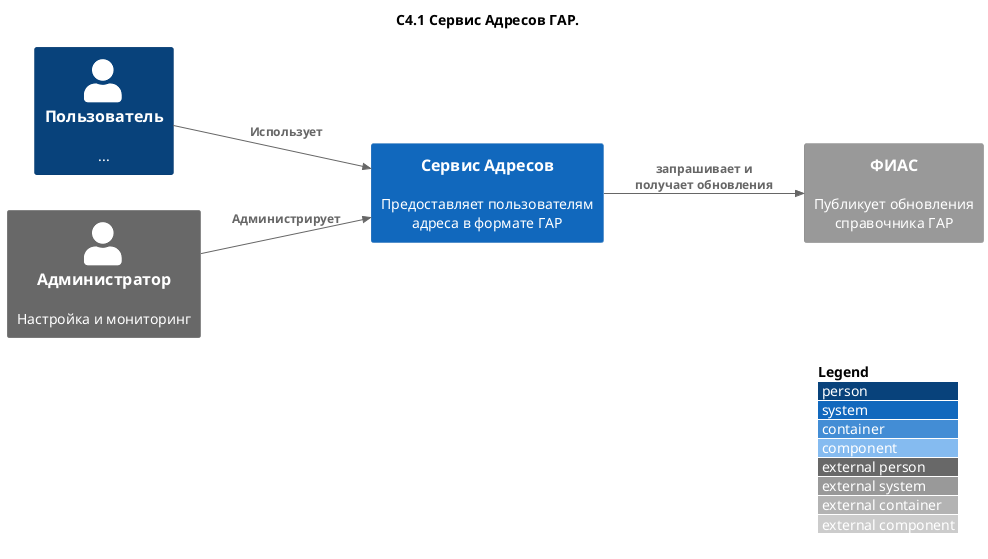
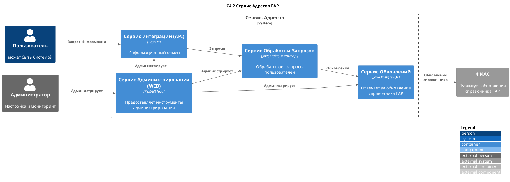
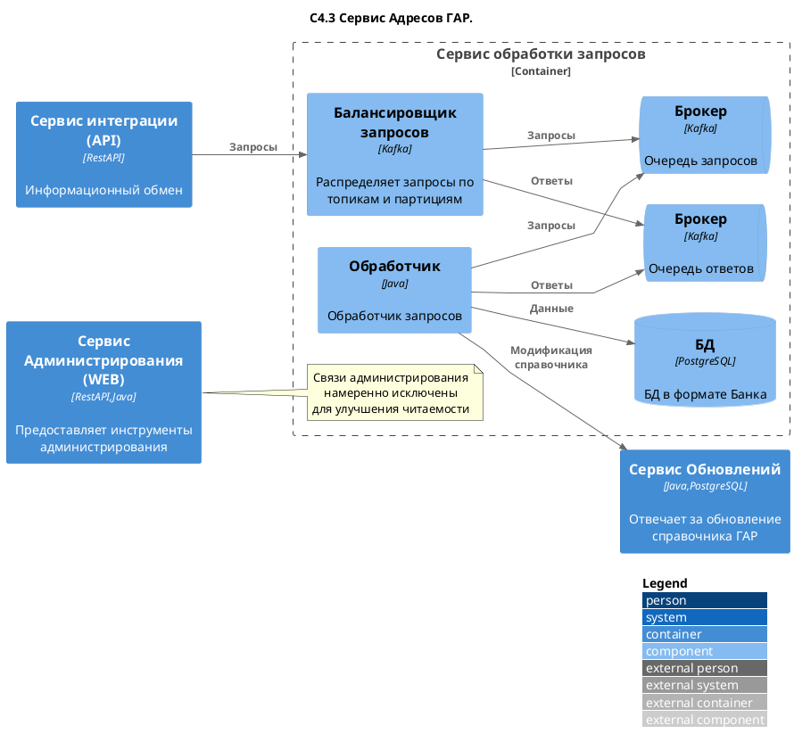

# Задание №6
>Требования к брокерам сообщений

Разработать документацию к сервису, отображающему информацию, полученную из внешней системы с помощью Кафка.

<details>

## ОБЯЗАТЕЛЬНО
- ФТ, НФТ, структура документа
- С4
- Описание топиков и подключение к Кафка
- Кто какой топик читает
- Кто в какой топик пишет
- Описание сообщения для каждого топика
- Маппинг значений в топике в БД, с преобразованиями если они нужны

Все остальное будет плюсом

</details>

<table width="1000" border="1">
<thead>
  <tr>
    <td rowspan="3"></td>
    <td colspan="2" width="700"><p align="center"><b> Сервис интеграции ГАР </b></p></td>
  </tr>
  <tr>
    <td>Дата</td>
    <td>23.08.2024</td>
  </tr>
  <tr>
    <td>Версия</td>
    <td>1.0</td>
  </tr>
</thead>
</table>


## Оглавление
[1. Предметная область. Термины и определения](#title1) <br> 
[2. User Story](#title2)</br>
[3. Проблематика и цель](#title3)</br>
[4. Нефункциональные требования](#title4)</br>
[5. Функциональные требования](#title5)</br>
[6. Архитектура. С4](#title6)</br>
[7. Описание Kafka](#title7)</br>

## <a id="title1"> 1. Предметная область. Термины и определения </a>

|Термин	|Определение|
|---|---|
|**Адрес**|Комплекс наименований адресообразующих элементов (страна, субъект Российской Федерации, федеральная территория, муниципальное образование, населенный пункт, элемент улично-дорожной сети, элемент планировочной структуры)|
|**ГАР**	|Государственный адресный реестр. Информационный ресурс, содержащий сведения об адресах.|
|**ФИАС**	|федеральная (государственная) информационная адресная система, обеспечивающая формирование, ведение и использование **ГАР**. Оператором **ФИАС** определена Федеральная налоговая служба (**ФНС**)|
|**Система**	|Комплекс программного и технического обеспечения предназначенный для поддержки бизнес-процессов **Банка**|
|**Сервис**	|Настоящий сервис интеграции **ГАР**, как комплекс программного и технического обеспечения предназначенный для обеспечения взаимодействия **ФИАС** и **Системы**|


### <a id="title1_2"> 1.2 Ссылки на существующую документацию </a>
|Описание|Ссылка|
|---|---|
|Раздел "Разработчикам" на сайте ФИАС/ФНС|[см. по ссылке](https://fias.nalog.ru/Frontend)|
|Условия использования API-сервисов ФИАС|[скачать .pdf](https://fias.nalog.ru/docs/Условия%20использования%20API-сервисов%20ФИАС.pdf)|
|Сервис «Получение сведений из ГАР»|[в формате Swagger](https://fias-public-service.nalog.ru/api/spas/v2.0/swagger/index.html)|

## <a id="title2"> 2. User Story </a>

- Я, как **Система**, хочу хранить адреса **Клиентов** в формате **ГАР**, чтобы исключить некорректное заполнение адресных данных Банка, Клиентов, Контрагентов во внутренних и  исходящих документах и отчетности Банка;

## <a id="title3"> 3. Проблематика и цель </a>

Привести разрозненные сведения об адресах к единому, унифицированному написанию, исключить дубли, ошибки и противоречия в адресах при информационном взаимодействии с **Системой**;

Обеспечить пользователям **Системы** возможность получить, проверить, сохранить **Адрес**  в формате **ГАР**.

Настроить регулярное обновление справочника **ГАР** в информационной системе **Банка**;

## <a id="title4"> 4. Нефункциональные требования и ограничения</a>

- **Сервис** не изменяет и не удаляет данные, полученные из **ФИАС**, без явного указания.

- Допустимые объемы информационного обмена устанавливаются и изменяются **ФНС** в одностороннем порядке в зависимости от имеющихся технических возможностей с учетом нагрузки, формируемой пользователями **ФИАС**.

- В настоящее время API **ФИАС** установлено ограничение на количество направляемых запросов, равное 100 запросов в минуту и 10 000 запросов в день.

## <a id="title5"> 5. Функциональные требования </a>

- Получение сообщений с обновлениями адресной информации из ФИАС.
- Обработка и преобразование данных в соответствии с внутренними стандартами.
- Запись обработанных данных в базу данных.
- Предоставление API для доступа к обработанной адресной информации.

## <a id="title6"> 6.  Архитектура. С4 </a>

### 1. Контекст


<details><summary> <i> см. plantUML (развернуть)</i> </summary>


</details>

### 2. Контейнеры

![SVG](https://www.plantuml.com/plantuml/svg/bLJRRkDK57ttLnpoKaUA4XZ2IuNGPD881g8XJ6TK8I55djXXhFfYsGuqugLD4K5g8KWyb1TQAl419cbfcalo2-Vy4MiVfvPfN6KQoSev-xBsscjl-saGQdxOiItbFTDfMHtTO1-togLgkLbrdT0u28iUd9zaUZNJCVm7_RRdEePpby-KBTzeixTXw6sNIfwbELIqs7BjKX3gblacXU2sssRBABqE33yeTO9qZQm8rx50fBavq7RVcDR_0fLWttGypTTiHXXXrpEOvrfTkYZA5b_maJZa4P_piUZpCH_YVCrdJFmCmo4CSt7Cn2zyIbOySz53pf2feeVRH1o97kF_u7Z3-99V8mKnV26EU9HFrVxUrxmzKm_ViYSVlI_h4lWABn8_eTXWMwbNllxozQjclV9YPxTQQTJKF8LIwP64lU9H4hJt_DLdpNhjqzgB7GeBpT0oMBLSVCBufUGn1EOHux_nAo85GaIR_mx3NqN0VaXy8-gT-X8zEcqpFk5JyQle5nY_WMU4f2abufamFcRuNn8kAKRyYqe3khkEIf8NM8vVK8OuHJPbHQGItNFacy7sBzM2Ok849K-9Az0eIdflS_aLOBDs4AgQRfiEPQ89-34CYYQkX4mQIjm_SPDMGa074J6LU1GlusJk2EYxtI0qR8dUDhMWaED_yp-0Vvd3yK8SOvPJ14zmaaGNCCof5ng3n1kmRnm8i2GI98peavdAhjH55UMkpZEtu-YQtrLR7n3JXoUJa-BH7Qqkg1s9FXM3cCSoIrSuPs33emG978PC_2XRdiLX2QiV6CPUVlJO2omUq4CBmF1BlXMgvfdef9hk4zBBV7hHvAe3HgqqdkUfvvT64E9CHynXdgAEG9eWR2VyDXw4V04XxxsIkhscxVh2ZF58wLP3LFTgpz8C2fzhtscRfW3064uSnsHmFc4ysbHjZNF7qzSudzzVDNvBV8XNeU46uRU-iVjLNL8y1x4XSliy8c9oQXcxYk5lsDHxj89ka4MB082zGDK9xS0PheIwY7StOVc5rjvVvvhaHwGMO1FE2Gf4pDvmFFHDKBPGQIW6S8uLvQLXhRuts3PMoANvi8mj6WE1SgJezDPJplaxYuLicIvNUwNGMPhx2bwwP8qCT358OEAFMhorsOiQVtnYsEOEPSXM7nKF8e-A1_lDyVWzDHozOrl_0G00)

<details><summary> <i> см. plantUML (развернуть)</i> </summary>


</details>

Ввиду установленных ограничений количества запросов использование системами **Банка** API **ФИАС** нецелесообразно. таким образом необходима разработка собственного **Сервиса**. При этом API **ФИАС** будет использоваться для обновления данных **ГАР** в **Сервисе**.

![SVG](https://www.plantuml.com/plantuml/svg/ZLHVRofL47y_dsBaHI2mDdqof99MGO91r49D4pNDWJsj6m-xPFzWep4fRM8VD69hNpNw3H11kFH2lyBiDxepNNOlt99xBm_TitjcVh_v_MQc-vulNJ_eQE5RlbQ0V-6_kC0bZl0U9tIQuGJ2FZw45pYaZylm6ldZ78U0V-3l-BSGNKAmsbPNsZwaJYtf6RRKpfdX1YcG7l0NqNBED-Fm7vmGvWXdOH--jd7vAcyuM14m27ZAxGbJ-h8bFKNPDtYtVcssXB9D9X5rnrSWswxZUL00l0MS4-mYl2JOUTZd9-2Kn8nnI69cW0zqFsPzE0sly3d5ZUWy2IyfUf23y9fobXIM54mMKEuWWlallA2iwPeZm6uHvWod53uXeWada4fc6y6wz7MC_mdqjuWLc1Blmr-vU60ahejKtE22_lv26hZ-v2LkXGnynmuwBUKAeHsdImwmE09OGAIG2o26AoAOuqomhv0lSfFOhiDoemcLSfDghIY_9Zs_v7nlQqUQ7rjQLUrJ9yhOo-VZbDsTdG9yqlYiJZdfBvNhMOvTDNCLwHv_MYifxSkZmrecJYjIgoWfx4Vpn8rUTvim4WW10AxDtNHwokKM0_-oMRmZJG_i3wTpGzcfLK_eTKYZT4yNF-EmaCqAiTTsJ5MCifkofHLe4hRYyU170T6l5pE3PVlgZ3Y_8dgm0wrpm8KKKkdtCmRUSll2VZIYM-OszKsCwAlpc0Vul0LmToTZ0Fv9HS-unIkiuMhpjiD3ZD_-LhM_AqcooBSwYbQvqtrAGNODsHLWpwXi1XeJr0IVnPCwOaKy3ozB3xecuRujzcjz-4dilPUqWDOqwYelB0siza4epJkTD1u-WEJyRYePKHwS3Pvma8mDZXEDcu90K5gSVFHvwQ1PNkz-Ed4mynYOBnu3ypqfwPsjDSKxOAwM9BrjwjUNvKow9oRVdfntjF63rOrSYE7uIL7HVwn81AkYIPuzxWPXGn4QNzGsJMaU7jGR1nyrgxI47vOhrRfX65jqftjI1yhBlC6IP0roqGniSKU8VQexwEWN)

<details><summary> <i> см. plantUML (развернуть)</i> </summary>

```plantUML
@startuml
title Обновление справочника ГАР

participant "fias.nalog.ru" as fias
box
participant "Сервис \nобновления ГАР" as serv
database "БД ГАР" as db
endbox

Note across : В контексте задачи подразумевается, что первичная загрузка ГАР произведена \nи в Сервис загружаются только изменённые данные ГАР

autonumber

loop : один раз в сутки
serv -> fias : REST GET \nGetLastDownloadFileInfo
serv <-- fias : 200: JSON \n(VersionId,GarXMLDeltaURL)
serv <-> db : сравнивается \nVersionId
   rnote over db
     **Дополнительная таблица:**

<code>
     Table lastVersions {
       versionId integer [not null, note:"(8).Версия обновления"]
       textVersion text [not null, note:"(20). Наименование обновления"] 
       checkDate timestamp [not null, note:"Дата последней проверки"]
       updateDate timestamp [not null, note:"Дата обновления"]
     }
</code>
   end rnote
end

alt 
else "VersionId = VersionId'"
serv -> db : обновляется дата проверки 
db -> db : UPDATE lastVersion(checkDate)
db -->X serv
else "VersionId != VersionId'"
serv -> fias : download(GarXMLDeltaURL)
serv <-- fias : gar_delta_xml.zip
end

serv -> serv : конвертация \nXML > SQL
serv -> db : TRANSACTION BEGIN...
db -> db : UPDATE (values)
db -> db : UPDATE lastVersion(versionId,updateDate)
db -->X serv
@enduml
```
</details>

Данные **ГАР**, полученные из внешней системы (**ФИАС**) будут предоставляться внутренним потребителям через собственный API

### 3.Компоненты

![SVG](https://www.plantuml.com/plantuml/svg/hPRVQXj75CRlzHIdll4QZ1LSNvbIujYcJMjIvqymXO9OIQjuyMftqQxQcjxOSgXIajOj3RIKuYPluCWIaMKfUeMPD-htpLXYLKd4XLmikpdpdND-vuyclfsaRYsjLuESVEI7fQ1UzkIJqbf-Swsm6OMfztsw4kFqqzd7hXzwjVc2QXo5NZYEa5kiUHNPJzDuFP-F0pTatfLILCqdQJdmYzaGKQNYbxpyuyIh9VbwaiqoKnA50LWADr1Mew8VP9MIouaa1tuOkpMtAeoJ7iQUn55mo7_aSelgdRhGH-fS3LHNDrLNjV3TKNtHps0uWc6WJqJ_hAvenJFG3VYqnC6xethwM3T4lS7dMr53rO4BDEgTFbRdInFPlwkvyPvVJlTbzTOjazc4jn7FzOz8TxeEZvsDhxzw_AYmit5lw-7cnkwsiqGnqr-Oq6rrdf7jtNtqUM5d-xFjUriKfduQUBAvjlAngDU6feMunw9-LMsY0OlmwdSONgqmy5ym34mjbsf03_rSraNrr9N-HJUNHRr5GouWkg8ddjwoi6WMBwehi0oPmhPGTH1KPBn1JZqkByl29CiP-ZKmqLWLlIuN8Fh2_TPTtesIz4dDUtX_XoPrXaGj-3Ov5TqmD4Wv5Q0Z81Xoa6I4dCOUjQRIXQK9A3Vs4NmpozIrJR3Bm66WD6TZz-uICHvuIOflG_GdX4_DxFfMoFx1zbnT6Z2x9FzDMAx2TseYq7P9odvo6V2mABkCf-BiRT_9vbzcXmp4FsRDsbmpBWyReKzDWnZGXjCdett5HA5vJpOGPv4BTw9wM7PhXqvfTGeTPPfMlm500stksYqPCgBTiFTH3hbG-WNS389fFG_xyar8Lhkhd5zBCks6R3pH7sIqldqJRc2B_I3hExhVdA8Ri9BVS7n52OJNVTC_SSDc5lwbMpcmSte5PhkNx4DdN7_M2y3a5p2HnQojwXks8ToFOEzopzWT32b3Tx_krJtdWDaCf07hSL2J56UwIICPz8ifuicOMqMdNBGblwJpvE-HrbaZONy619yBkFf_2BbLBJPgciz93XFZaLr1St7tHdV8mfppMPNd5l7PqgSuwdBo3xp0PhY-j_w6hetUFxLpiNEOSzSGb07izNAzENza1prMc4FJb_aQODnCO-Vr4W9x3tLcX5ZDNgQDcIGp9RamIZsf-K_sKuagWdiCHlLwrB8Rt2k25_RPZfU4M7LgHpzH607Dg6qOqDiJl4vqKpypSaRW-C1b_b-sbmc6vOLb8LpkDhxuLyw_)

<details><summary> <i> см. plantUML (развернуть)</i> </summary>


</details>

## <a id="title7"> 7. Описание Kafka </a>

<br>
<br>
